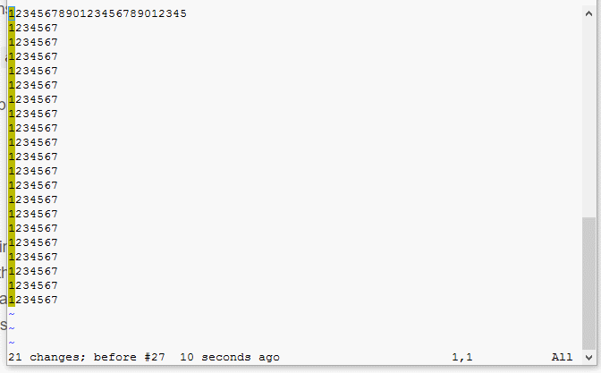

# Macros

- Want to insert text in front of multiple lines:
    - Step 1: Move the cursor to the line from where you would like to insert the text. 
    - Step 2: Hit `Ctrl + V` to enter into Visual Block and use cursor to select the first column till line where you want to stop inserting the text.
    - Step 3: Hit `Shift + i` to enter into insert mode. Type text you would like to insert and hit ESC. You will see the text being insert automatically to all the lines selected in Step 2.
    

